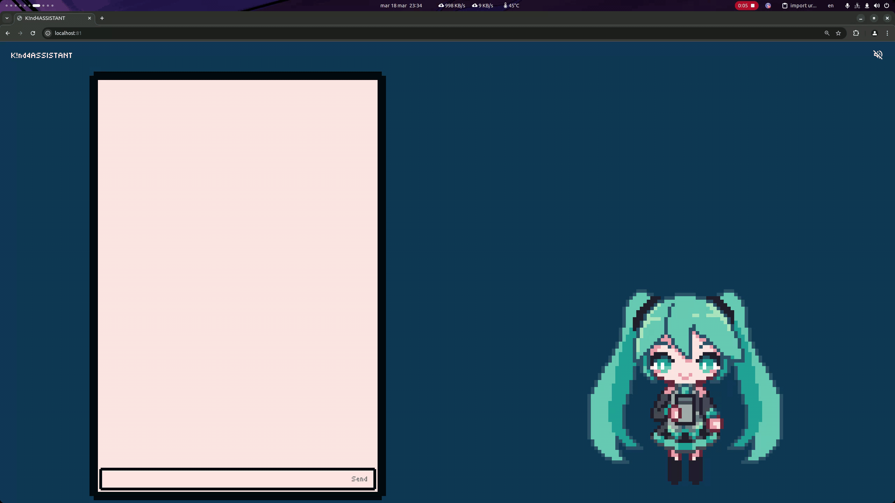

<h1 align="center">K!nd4ASSISTANT</h1>
<h4 align="center">Web challenge for the K!nd4SUS CTF 2025</h4>

## About

K!nd4ASSISTANT is a chatbot assistant in the body and expressions of Hatsune Miku who's supposed to help you in the K!nd4SUS CTF 2025 but actually has no clue in how to do so and is also vulnerable to self-XSS attacks through [UnderConstruction](https://github.com/sniirful/UnderConstruction). It serves as another web challenge for the CTF.

## Hosting
Prerequisites:
- [UnderConstruction](https://github.com/sniirful/UnderConstruction)
- [ollama](https://github.com/ollama/ollama)

After that, just change the [docker-compose.yaml](docker-compose.yaml) by setting the correct URLs to UnderConstruction and ollama. Finally, you can run:
```bash
git clone https://github.com/sniirful/K1nd4ASSISTANT.git
docker compose up
```

## Writeup
Challenge description:
> Are you stuck on a challenge? Do you need help to understand something? Are you starting to think you can’t do it?
> 
> Relax, we’ve built the only assistant you’ll need for this CTF round. Just ask a question, let her think, and get the answer you were looking for.
> 
> P.S.: we’ve worked hard to integrate it deeply especially with UnderConstruction, maybe if you're stuck there you can start over from here...

You can find the writeup [here](WRITEUP.md).

## Vulnerabilities
K!nd4ASSISTANT doesn't really do any heavy data processing or storing, since it requires a login with [UnderConstruction](https://github.com/sniirful/UnderConstruction) and thus lets it handle the users and the security behind it.

It is, however, in a way "integrated" with the service mentioned above, as in Miku actually has internet access and, specifically, admin access in the social network. This is done through a cookie set into Puppeteer, we can see that into [backend/browser.ts:8-19](backend/browser.ts#L8-L19):
```ts
async function initializeBrowser(): Promise<void> {
    browser = await puppeteer.launch({
        headless: true,
        args: ['--no-sandbox', '--disable-setuid-sandbox']
    });
    await browser.setCookie({
        name: 'user_id',
        value: UNDERCONSTRUCTION_ADMIN_COOKIE,
        domain: new URL(UNDERCONSTRUCTION_URL).hostname,
        path: '/'
    });
}
```
The problem with this function is that the cookie is not set as HTTPOnly, thus being available with `document.cookie` through JavaScript inside the page.